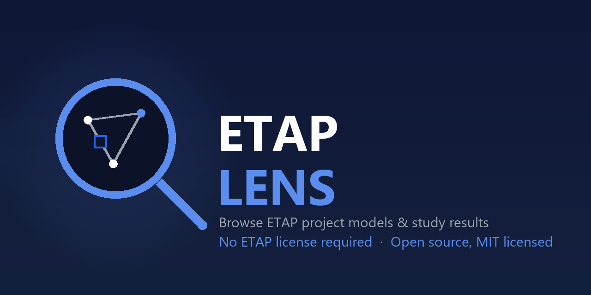

<p align="center">
  
</p>

# ETAP Lens

**Browse ETAP project models and study results in your browser — no ETAP license required.**

ETAP Lens is a local web app for power systems engineers to explore ETAP project data (buses, cables, transformers, generators, loads, protective devices) and study results (short circuit, load flow) without needing ETAP itself installed. Point it at a project folder, pick a file, and get a searchable, filterable, exportable view of everything inside it.

> **Unofficial / independent project.** ETAP Lens is not affiliated with, endorsed by, or associated with ETAP® or Operation Technology, Inc. "ETAP" is a trademark of its respective owner; it's referenced here only to describe compatibility with ETAP's file formats.

## Why this exists

An ETAP `.oti` file is **not** the project database — it's a small container holding a connection pointer (ODBC DSN/DBQ) plus user and permission records. The real engineering data lives in a SQL Server database file next to it:

- `<name>.MDF` — the live database (preferred)
- `<name>.BAK` — a backup, used as a fallback if no `.MDF` is found

ETAP Lens figures out which file actually has the data, reads it (via a local, throwaway copy — your original files are never modified), and shows everything in a browsable web UI.

Study result files (`.SA1S`, `.SA2S`, `.LF1S`, `.UL1S`, `.TU1S`, `.HA1S`, `.GRDS`) are a separate case: they're already plain SQLite files (ETAP writes them that way), so they're read directly — no SQL Server involved, and loading is near-instant.

## Features

- **Load a project model** (`.oti`/`.mdf`/`.bak`) or **study results** — short circuit (`.SA1S` ANSI duty, `.SA2S` fault currents by type), load flow (`.LF1S` balanced, `.UL1S` unbalanced/3-phase), time-domain load flow (`.TU1S` TDLF — typically a full 8760-hour year), harmonics (`.HA1S` — both frequency scan and harmonic load flow), and ground grid (`.GRDS`)
- **Harmonic plot curves folded in** — a harmonic run keeps its curves in `.fspdb`/`.hfpdb` files beside the `.HA1S`; open the `.HA1S` from a project folder and the impedance-vs-frequency sweeps, spectra and waveforms come with it, each point tagged with the device it belongs to
- **Annual AC loss report** for TDLF results — energy losses split across transmission lines, cables, unit transformers and main power transformers; generation at the units; and net output at the point of interconnection, all derived on import and reconciled against ETAP's own system totals
- **In-app folder browser** — navigate real folders and drives from inside the page (no native OS dialog limitations), with quick-access shortcuts to Desktop/Documents/Downloads/Home, and a "Select This Folder" action to scan and pick from everything loadable in it
- **Load an entire folder at once** — paste or browse to a folder and get a pick-list of every `.oti`/`.mdf`/`.bak`/study-result file in it
- **Curated category views** tailored to what's loaded:
  - Project model: Buses, Cables & Lines, Transformers, Generators & Sources, Loads & Motors, Protective Devices, Capacitors & Reactors, Meters
  - Short-circuit study: Device Duty, Bus Duty (Interrupting/Momentary), Fault Currents by type, Clipping Current, Alerts
  - Load flow study: Bus Voltage & Loading, Branch Loading/Losses, System Totals, Voltage Violations, Alerts
  - Harmonic study: Frequency Scan, Plot Curves, Voltage Distortion, Bus/Branch Harmonic Spectrum, IEEE 519 Limits, Harmonic Sources & Filters, Alerts
  - Ground grid study: resistance to remote earth, ground potential rise, mesh and step voltages calculated vs. tolerable
- **Single Line (Bus Explorer)** — pick a bus, see every cable, transformer, breaker/switch, load, and source connected to it (a tabular topology view)
- **Every table view has**: search (scoped to one column or all), sortable columns, pagination, a column-visibility panel (wide tables auto-hide audit-trail noise columns like `IID`/`Revision`/`Checker*`), and a Sum/Average/Min/Max/Count summary row
- **Export** any view to CSV or Excel (`.xlsx`), respecting your current filter/search/column-visibility state
- **Violations Report** — one click bundles every alert/violation table in a loaded study into a single formatted Excel workbook
- **Unload** — remove any loaded project from the cache individually, or clear everything at once
- **All Tables (raw)** — browse any underlying table directly, including per-revision history (`H1`–`H8`) and rating (`_R`) tables not part of the curated categories

## Screenshot

*(Add a screenshot here — run the app, load a project, and drop an image at `docs/screenshot.png`.)*

## Requirements

- Windows (this project relies on SQL Server LocalDB and the Windows registry for a couple of features — see [Platform notes](#platform-notes))
- Python 3.10+
- A local SQL Server / SQL Server LocalDB instance. ETAP itself normally installs one named `ETAPLocalDB19` (matches the `DSN=otilocaldb19` seen in `.oti` connection strings) — if that's present, no extra setup is needed. Study result files (`.SA1S`/`.SA2S`/`.LF1S`/`.UL1S`/`.TU1S`/`.HA1S`/`.GRDS`) don't need this at all, since they're already SQLite.
- `sqlcmd` and the "ODBC Driver 17 for SQL Server" (both ship with SQL Server / SSMS tooling)

## Quick start

```bash
git clone https://github.com/hmazin/ETAP_LENS.git
cd ETAP_LENS
pip install -r requirements.txt
python app.py
```

Then open **http://127.0.0.1:5151**. Click **Browse Folders...** to navigate to your ETAP project directory, or paste a path directly. The first load of an `.mdf`/`.bak` takes a minute or two (it copies the database, attaches it, and reads every table); study result files load in a couple of seconds. Results are cached in `cache/` (git-ignored) and reload instantly unless the source file changes.

## Running it hosted

The app has two modes, set by `ETAP_LENS_MODE`. It defaults to **`local`** — the desktop case, where the server is your own machine, so browsing the filesystem and loading a file by absolute path are the whole point.

**`hosted`** is for running it on a server that serves other people. Those same features become an unauthenticated directory lister over the server's disk, so they're switched off and upload becomes the only way in:

| Variable | Default | Purpose |
|---|---|---|
| `ETAP_LENS_MODE` | `local` | `local` or `hosted` |
| `ETAP_LENS_MAX_UPLOAD_MB` | `300` | Rejected with a JSON 413 above this |
| `ETAP_LENS_CORS_ORIGINS` | — | Comma-separated exact origins allowed to call the API |
| `ETAP_LENS_CORS_ORIGIN_REGEX` | — | For preview deployments with generated hostnames |
| `ETAP_LENS_LITE_CACHE` | on when hosted | Keep only the summary tables (see below) |
| `ETAP_LENS_GCS_BUCKET` | — | Object storage for uploads; local disk if unset |
| `ETAP_LENS_TURNSTILE_SITE_KEY` / `_SECRET_KEY` | — | Bot check on the upload-URL endpoint; off unless both are set |
| `ETAP_LENS_MAX_UPLOADS_PER_SESSION` | `25` | Per-session ceiling on loaded files |
| `ETAP_LENS_DERIVE_TIMEOUT` | `300` | Seconds before an import is aborted |
| `ETAP_LENS_CACHE_TTL_HOURS` | `168` | Age at which idle caches are swept |

In hosted mode `/api/browse`, `/api/browse/quick`, and path-based `/api/load` return 403, and the frontend hides the controls that use them (it reads `/api/config` at startup). Only study result files are supported — `.MDF`/`.BAK` need SQL Server LocalDB, which is Windows-only.

Hosted mode also requires an `X-Session-Id` header on every API call. The browser generates a 128-bit random id and keeps it in `localStorage`; everything cached is namespaced by it, so one visitor's uploads are invisible to another and two people uploading files with the same name don't collide. It's a header rather than a cookie because the frontend and API can be on different origins. Locally there's one user, so no session is required and the cache is shared — the desktop app behaves exactly as it always has.

Uploads are validated before anything opens them: extension allowlist, SQLite magic bytes (an extension is a claim, not evidence), and a schema-readable check. Imports run under a wall-clock deadline, because file size bounds how much data there can be but not how long working over it takes.

**Deploying it for real:** see [docs/DEPLOYMENT.md](docs/DEPLOYMENT.md).

> Anchor `ETAP_LENS_CORS_ORIGIN_REGEX` to your own hostnames. A pattern like `.*\.vercel\.app` would let anybody's app call your API from a visitor's browser.

### Lite cache

A time-domain study is mostly per-step detail — a year of hourly results across 54 branches is ~473,000 rows, while the derived summaries that answer almost every real question are ~27,000. With `ETAP_LENS_LITE_CACHE` on, the per-branch series is never built and ETAP's own per-step tables are dropped once the summaries are computed:

| | Cached size | Tables | Rows |
|---|---:|---:|---:|
| Full | 271.9 MB | 46 | 1,025,231 |
| Lite | 3.7 MB | 40 | 26,591 |

Every summary table is byte-identical between the two — lite changes what you can drill into, never a number. What it costs is the "Branch Time Series" and "Raw Result Tables" views, which the UI labels as deliberately empty rather than leaving you to wonder.

It only applies to time-domain results; nothing else has per-step tables worth dropping. Off by default locally, on by default when hosted, where it's the difference between an expensive service and a cheap one — and means what sits at rest is aggregate results rather than a complete model.

Build and run the container:

```bash
docker build -t etap-lens . && docker run -p 8080:8080 -e ETAP_LENS_CORS_ORIGINS=https://your-frontend.example.com etap-lens
```

The frontend in `web/` is plain static files with no build step, so it can be served by Flask (same origin, nothing to configure) or uploaded to any static host — in which case set `window.ETAP_API_BASE` in `web/config.js` to the backend's URL.

## Command-line tools

If you just want a quick dump without the browser UI:

```bash
python read_oti.py "path\to\etapmodel.oti"                     # dump the .OTI container itself
python dump_mdf.py "path\to\etapmodel.oti" --out model.sqlite   # full project -> one portable .sqlite file
```

`dump_mdf.py` accepts any of `.oti`/`.mdf`/`.bak`/`.sa1s`/`.sa2s`/`.lf1s`/`.ul1s` directly and auto-resolves `.oti` → `.mdf`/`.bak` the same way the web app does.

## How it works

1. **`etap_reader/locate.py`** — given an `.oti`, parses its `ODBCInfo/ConnectionString` stream to get the real database name (`DBQ=`), then looks for `<name>.MDF` / `<name>.BAK` next to it. Study result extensions (`etap_reader/study_result.py`) are recognized directly.
2. **`etap_reader/mdf_dump.py`** — for `.mdf`/`.bak`: copies the source file, attaches/restores it on a local SQL Server LocalDB instance, walks `INFORMATION_SCHEMA` to read every table's schema and rows, writes it all into a single SQLite file, then detaches and deletes the working copy.
   **`etap_reader/study_result.py`** — for study result files: copies the (already-SQLite) file directly via SQLite's own backup API, then strips ETAP's print-formatting spacer rows (`###<<<BlankLine>>>###`) before indexing. Much faster since there's no SQL Server step.
3. **`etap_reader/project_cache.py`** — caches the resulting `.sqlite` per source file (keyed by path + size + mtime) so repeat loads are instant, and handles unloading.
4. **`etap_reader/browse_fs.py`** / **`etap_reader/folder_scan.py`** — server-side filesystem browsing, since browsers don't expose real paths from native file pickers and a native "select folder" dialog doesn't show files while browsing.
5. **`etap_reader/xlsx_export.py`** — formats CSV-shaped data into styled `.xlsx` workbooks for export and the violations report.
6. **`app.py`** — a Flask API over the cached SQLite file; **`web/`** is a plain-JS single-page frontend with no build step (no npm, no bundler — just open and edit). It contains no server-side templating, so Flask can serve it directly (the local case, same origin as the API) or it can be hosted separately with `web/config.js` pointing at the backend's URL.

## Project structure

```
app.py                      Flask app / API routes
etap_reader/
  locate.py                 .oti -> .mdf/.bak resolution, study file recognition
  mdf_dump.py                SQL Server LocalDB attach + dump to SQLite
  study_result.py            direct SQLite copy + cleanup for study result files
  time_domain.py             TDLF (.TU1S) derived summaries + annual AC loss report
  ha_plots.py                harmonic plot curves (.fspdb/.hfpdb) folded into their .HA1S
  ground_grid.py             .GRDS cleanup (binary geometry column, epoch RunDate)
  categories.py               curated table groupings per project/study type
  project_cache.py            caching, loading, unloading
  folder_scan.py               flat "what's loadable in this folder" scan
  browse_fs.py                 in-app folder browser backend
  xlsx_export.py               Excel export formatting
  oti_parser.py                 raw .OTI (OLE compound file) parser
web/index.html               page shell (plain HTML - no templating)
web/app.js                    frontend logic (tables, search, export, browser modal)
web/style.css                  styling
web/config.js                  API base URL (empty = same origin)
read_oti.py, dump_mdf.py         standalone CLI tools
```

## Platform notes

This was built and tested on Windows against ETAP 24. A few pieces are Windows-specific:

- SQL Server LocalDB (for `.mdf`/`.bak` project models)
- The Windows registry lookup for Desktop/Documents/Downloads quick-access folders (handles OneDrive Known Folder Move redirection)
- Drive-letter enumeration (`C:\`, `D:\`, ...) in the folder browser

Study result file support (`.SA1S`/`.SA2S`/`.LF1S`/`.UL1S`/`.TU1S`/`.HA1S`/`.GRDS`) has no Windows-specific dependencies and should work anywhere Python + Flask run. Cross-platform support for the rest is a good first contribution — see below.

## How ETAP's file formats actually work

ETAP doesn't publish documentation for its file formats, so everything this
tool knows was determined by directly inspecting real project files. That
investigation - what's in the `.OTI` vs `.MDF` vs `.LDF`, what each table
category means, and an in-progress reverse-engineering log for where the
one-line diagram's actual element positions/sizes are stored - is written
up in [docs/FILE_FORMAT_NOTES.md](docs/FILE_FORMAT_NOTES.md). Worth
reading before touching `etap_reader/`.

## Known limitations

- The "Single Line" view is a connectivity summary built from each element's `FromBus`/`ToBus`/`Bus`/`FromElement`/`ToElement` fields, not a rendering of the actual one-line diagram graphics (bus positions, symbol placement, wire routing). A graphical SLD renderer would be a substantial follow-on project.
- Only tested against ETAP 24 output. Table/column names may differ across ETAP versions — if something doesn't map correctly, please open an issue with the version you're on.
- `_R` rating sub-tables were empty in every project this was tested against; they're still browsable under "All Tables" if your project populates them.

## Ideas for contribution

Some directions that would add real value, roughly in order of impact vs. effort:

- **Cross-link the model to its study results** — click a bus in the Single Line Explorer and see its short-circuit duty / load flow results inline, pulled from whichever studies are also loaded
- **Cross-platform support** — swap the SQL Server LocalDB dependency for something portable (e.g. `mdbtools`/a pure-Python MDF reader) so this runs on macOS/Linux
- **Graphical one-line diagram** rendering
- **Case comparison view** — same bus/device across multiple loaded study cases side by side
- **Charts** — voltage profile, loading margin, duty-vs-rating visualizations instead of just tables
- **Conditional formatting** in table views — color cells by % of rating
- Support for more ETAP result file types (transient stability, arc flash, reliability, protective coordination)

Found a bug or have a feature idea? Open an issue. Pull requests welcome — see [CONTRIBUTING.md](CONTRIBUTING.md).

## License

[MIT](LICENSE) © 2026 [Hooman Mazin](https://github.com/hmazin)

## Disclaimer

This is an independent, community-built tool for reading ETAP's file formats. It is not produced, reviewed, or endorsed by ETAP / Operation Technology, Inc. Use it at your own risk, and always cross-check critical engineering results against ETAP itself.
